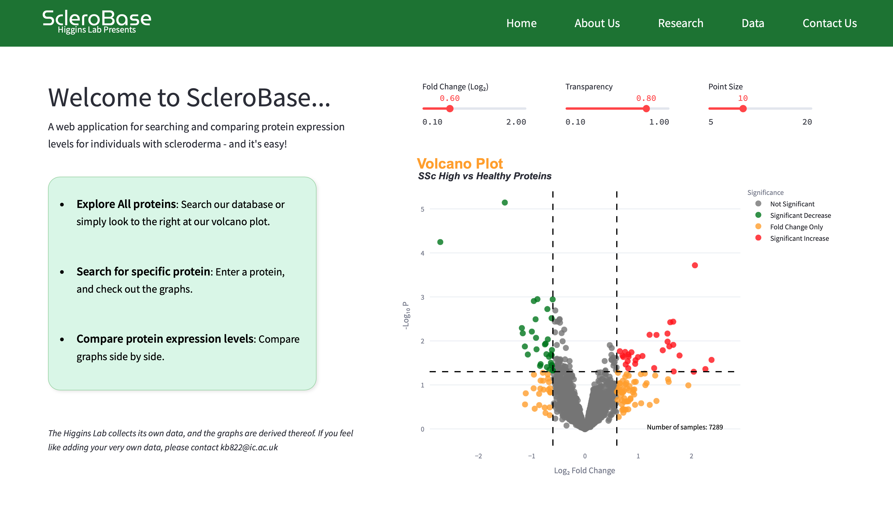
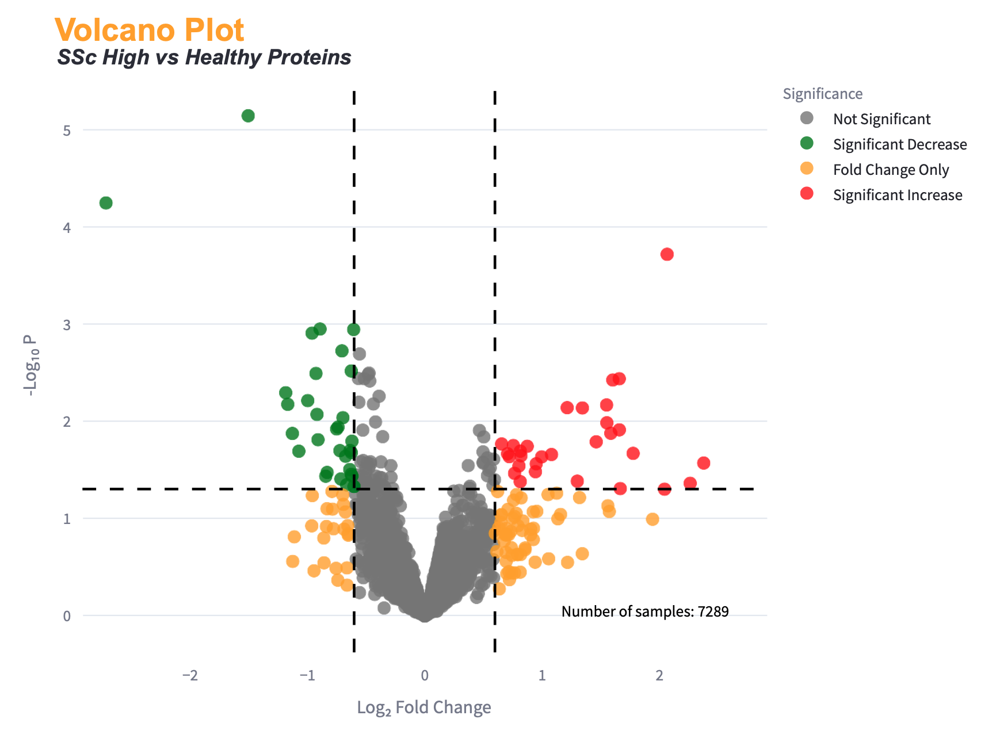
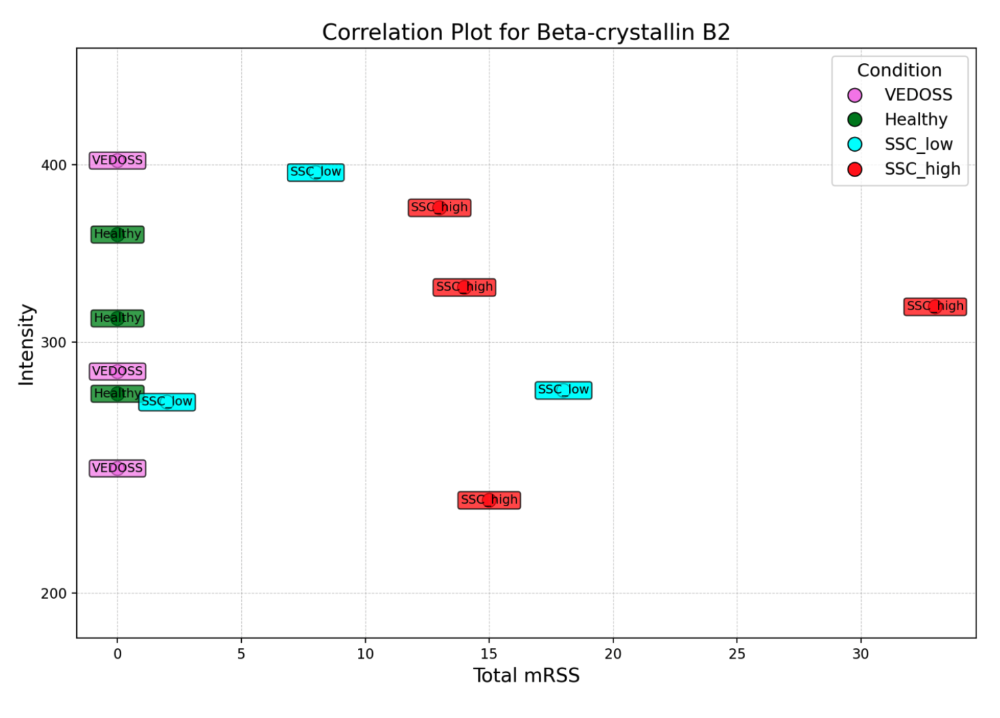
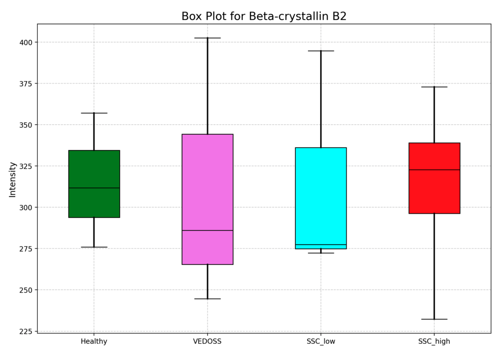

<p align="center">
  
</p>

<p align="center">
  <i>  Monitoring Progression of Scleroderma </i>
</p>

---
## Project Description
<p align="center">
  
</p>

**ScleroBase** is a website for visualising datasets to study protein expression in Scleroderma patients. The website is able to 
generate the following plots:
- Correlation Plot
- Boxplot
- UMAP plot
- Volcano plot
- Violin plot


## Table of Contents

- [Introduction](#introduction)
- [Features](#features)
- [Installation](#installation)
- [Usage](#usage)
- [Contributing](#contributing)
- [License](#license)
- [Contact/Support](#contact)
  
---

## Introduction

Scleroderma is an autoimmune disease that can cause thickened areas of skin and connective tissues. To gain a deeper
understanding of this condition, analysing the expression of different proteins observed in Scleroderma patients is 
highly beneficial.
This website utilizes a dataset to generate 4 graphs, enabling researchers to analyse results while requiring
minimal bioinformatics expertise.


## Features

#### Selecting Protein
Users can search for proteins using multiple naming conventions including:
- Protein Name
- Full Protein Name
- Entrez Gene ID
- Entrez Gene Symbol

Alternatively, users can utilize the volcano plot on the main page to select a protein by hovering over and clicking 
on the plot.
#### Volcano Plot
The volcano plot plots the relationship between the fold change (log₂ scale) and the significance (represented as -log₁₀ of the P-value) of more than 7000 proteins. It visually highlights significant increases and decreases in expression, statistical signifiance with the P-value, and a customizable threshold for fold change. The dataset is a comparison between scleroderma and healthy patients.

<p align="center">
  
</p>

#### Correlation Plot
The correlation plot represents intensity of protein expression across thirteen patients as a function of their MRSS score. The MRSS score classifies patients into groups (i.e. Healthy, VEDOSS, SSC low and SSC high). This helps (potentially) highlight proteins and how their expression affects progression of scleroderma.

<p align="center">
  
</p>

#### Box Plot
The box plot represents the intensity of protein expression across different patient conditions, illustrating how the expression levels vary between groups (i.e. Healthy, VEDOSS, SSC low and SSC high). This allows researchers to identify patterns or differences in protein expression linked to specific conditions. It displays the spread of the data; the interquartile range as a box with the median represented as a black line. 

<p align="center">
  
</p>

#### UMAP Plot
The UMAP (Uniform Manifold Approximation and Projection) is an algorithm based on reducing a high-dimensional dataset to a smaller 2D or 3D plot. In doing so, the plot represents similar cells closer together as clusters while distancing different cells. The generated plots visualise the expression of the chosen protein across cells and cell types. 
The Leiden-clustered UMAP plot presents each point as a cell with clusters representing a specific cell type. 
The specific protein UMAP plot shows the expression level of that protein within the UMAP space with the colour gradient portraying expression intensity (low expression in grey to high expression in blue).

#### Violin Plot
The violin plot uses the same single cell database file as the UMAP plot, providing an alternative visualisation of the data. This plot showcases the distribution of the protein expression across cell types.


## Installation

1. Clone the repository:
```bash
 git clone https://github.com/ainiimura21/name1.git
```

2. Install dependencies:
```bash
pip install numpy pandas matplotlib seaborn streamlit scanpy
 ```

## Usage

To run the project, use the following command:
```bash
streamlit run app/main.py
```

## Contributing

1. Fork the repository.
2. Create a new branch: `git checkout -b feature-name`.
3. Make changes.
4. Push your branch: `git push origin feature-name`.
5. Create a pull request.

## Acknowledgements

We would like to thank Dr. Claire Higgins' Lab for their support and guidance throughout the development of this project. 
